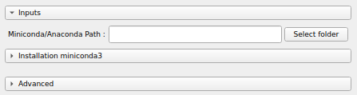
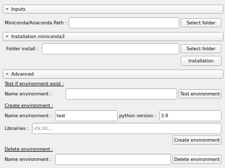

# SlicerConda
This extension is currently not available on Mac.
SlicerConda is an extension for efficiently installing and managing Conda environments on Linux, Windows, and Windows Subsystem for Linux (WSL). It simplifies the process of setting up Miniconda and offers straightforward environment management for both users and developers within the Slicer platform.

    

## Features
- Conda Installation: Facilitates Miniconda installation on various operating systems.
- Custom Installation Path: Allows users to select their preferred directory for Miniconda.
- Environment Management: Provides capabilities to create, delete, and verify Conda environments.
- Developer Integration: Includes CondaSetUpCall and CondaSetUpCallWsl classes for advanced Conda operations.
- Script and Command Execution: Enables launching Python scripts and commands in specified Conda environments.

## Using SlicerConda
### For Users
- Setup Conda: After Miniconda installation on Linux/Windows/WSL, enter the path to the Miniconda folder.
- Manage Environments: Utilize SlicerConda's interface to create, delete, or check the existence of Conda environments.

    

### For Developers
Classes for Manipulation: Use ***CondaSetUpCall*** (for Linux and Windows) or ***CondaSetUpCallWsl*** (for WSL) in your scripts to interact with Conda.
#### Functionalities:
- Retrieve the Miniconda path.
- Create, delete, or test the existence of environments.
- Execute Python files or specific commands in chosen environments.

#### Functions :

| Function name | CondaSetUpCall                   | CondaSetUpCallWsl |
|-----------|------------------------------|-----------|
| getCondaPath | Input : None Output : str | Input : None Output : str |
| getCondaExecutable | Input : None Output : str | Input : None Output : str |
| getActivateExecutable | Input : None Output : str | Input : None Output : str |
| condaTestEnv | Input : name:str Output : bool | Input : name:str Output : bool  |
| condaCreateEnv | Input : name:str,python_version:str,list_lib:[str],tempo_file="tempo.txt",writeProgress=False Output : None | Input : name:str,python_version:str,list_lib=[str],tempo_file="tempo.txt",writeProgress=False Output : str |
| condaInstallLibEnv | Input : name:str,requirements: list[str] Output : str | Input : name:str,requirements: list[str] Output : str |
| condaDeleteEnv | Input : name:str Output : str | Input : name:str Output : str |
| condaRunFilePython | Input : file_path:str,args=[],env_name="None" Output : str | Input : file_path,env_name="None",args=[] Output : str |
| condaRunCommand | Input : env_name: str, command: list[str] Output : str | Input : command: list[str],env_name="None" Output : str |
| getUser | Doesn't exist | Input : None: str Output : str |
