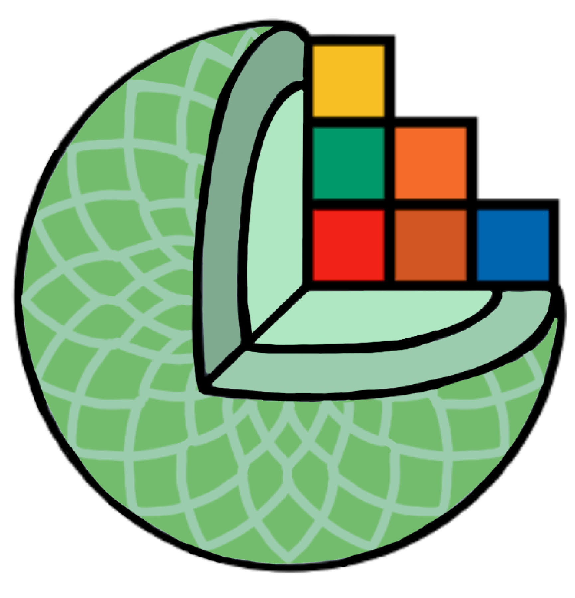

# SlicerConda

07/03/2025: MacOS distributions are now supported!
SlicerConda is an extension for efficiently installing and managing Conda environments on Linux, Windows, and Windows Subsystem for Linux (WSL). It simplifies the process of setting up Miniconda and offers straightforward environment management for both users and developers within the Slicer platform.

    

## Features
- Conda Installation: Facilitates Miniconda installation on various operating systems.
- Custom Installation Path: Allows users to select their preferred directory for Miniconda.
- Environment Management: Provides capabilities to create, delete, and verify Conda environments.
- Developer Integration: Includes CondaSetUpCall and CondaSetUpCallWsl classes for advanced Conda operations.
- Script and Command Execution: Enables launching Python scripts and commands in specified Conda environments.

## Why use SlicerConda ? : 
Here are two scenarios in which you could use this extension, highlighting its benefits for users and developers alike:  
- **Scenario Introduction**: ShapeAXI, a Python library, cannot be directly installed in Slicer due to version conflicts with existing libraries. Additionally, Pytorch3D, a Python module available exclusively on Linux, poses a challenge for Windows users. To utilize a module dependent on Pytorch3d on Windows, execution within a Conda environment through WSL becomes necessary.
- **Solution for Users - SlicerConda**:
    - Simplifies the Miniconda3 installation process on Linux, Windows and WSL.
    - Enables effortless integration of the Miniconda installation path with 3D Slicer.
- **Solution for Developers - SlicerConda**:
    - Provides a straightforward mechanism for creating and managing new environments within 3D Slicer, linking directly to an external Miniconda/Anaconda environment manager.
    - Allows libraries (ShapeAXI or Pytorch3D in our scenarios) to be installed from 3D Slicer into an external environment, guaranteeing its seamless integration into the development process.
    - Facilitates the execution of specialized code (in our scenario : utilizing Pytorch3D) or commands (in our scenario : from ShapeAXI) within 3D Slicer, but in an external Conda environment, promoting an efficient and integrated workflow for developers.

## Using SlicerConda
### For Users
Certain modules may require external execution from Slicer. For this to be feasible, Slicer must be informed of the location of Miniconda/Anaconda on the user's computer. Users have the option to specify the installation path, proceed with the installation if it's not already installed, and manage their environment or conduct tests using advanced options. Here are the specifics:
- Configuring Conda: In the "Input" section, users can direct 3D Slicer to the Miniconda3 installation location on their computer by utilizing the "Select a folder" feature.
- Miniconda3 Installation: Within the 'Installation miniconda' area, users can select their preferred installation directory for Miniconda. Following the selection, the installation is initiated by clicking the 'Install' button.
- Environment Management: The 'Advanced' section in Slicer offers tools for managing Conda environments. This includes options to create, remove, or confirm the presence of Conda environments on the user's device.

    

### For Developers
Classes for Manipulation: Use ***CondaSetUpCall*** (for Linux and Windows) or ***CondaSetUpCallWsl*** (for WSL) in your scripts to interact with Conda.
#### Functionalities:
- Retrieve the Miniconda path.
- Create, delete, or test the existence of environments.
- Execute Python files or specific commands in chosen environments.

#### Functions :

| Function name | CondaSetUpCall                   | CondaSetUpCallWsl |
|-----------|------------------------------|-----------|
| getCondaPath | Input : None Output : str | Input : None Output : str |
| getCondaExecutable | Input : None Output : str | Input : None Output : str |
| getActivateExecutable | Input : None Output : str | Input : None Output : str |
| condaTestEnv | Input : name:str Output : bool | Input : name:str Output : bool  |
| condaCreateEnv | Input : name:str,python_version:str,list_lib:[str],tempo_file="tempo.txt",writeProgress=False Output : None | Input : name:str,python_version:str,list_lib=[str],tempo_file="tempo.txt",writeProgress=False Output : str |
| condaInstallLibEnv | Input : name:str,requirements: list[str] Output : str | Input : name:str,requirements: list[str] Output : str |
| condaDeleteEnv | Input : name:str Output : str | Input : name:str Output : str |
| condaRunFilePython | Input : file_path:str,args=[],env_name="None" Output : str | Input : file_path,env_name="None",args=[] Output : str |
| condaRunCommand | Input : env_name: str, command: list[str] Output : str | Input : command: list[str],env_name="None" Output : str |
| getUser | Doesn't exist | Input : None: str Output : str |

## Example of SlicerConda use for developers :
For a practical demonstration of SlicerConda's capabilities, check out a straightforward example [here](https://github.com/DCBIA-OrthoLab/SlicerConda/blob/main/Example/Example.py#L265C1-L348C69). This particular module is designed for thresholding an image within a specific Conda environment. 
- **Environment Verification**:  The module verify the existence of the required Conda environment and the module needed for image thresholding.
- **Setup and Installation**: In cases where the environment or module is absent, the module uses SlicerConda,with the user's consent, to automatically configure the environment. It then installs all the components required to facilitate the image thresholding process.  
- **Running** : Using SlicerConda, the module executes a python code to threshold an image in a specific Conda environment.

## Idea for improvements : 
- Make it available on Mac
- Create a button to automatically launch a terminal in a specific environment
